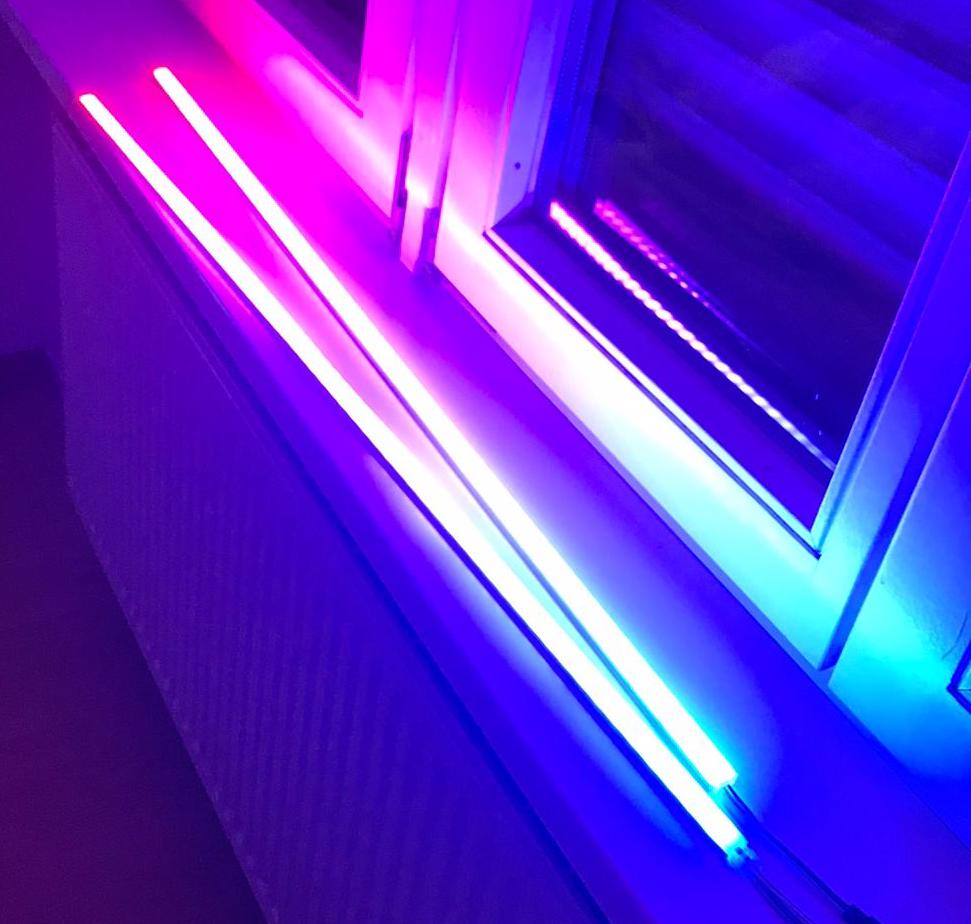

# SmartLight

This code enables remote control via a webpage of a LED light strip, perfect for ambient lighting applications such as home, van, shed, etc. Can support multiple light strips.

It can be controlled via a web page.

Beautiful animations :-).

Or just set the mood!

## Required Hardware

- Raspberry Pi
- LED light strip with individually addressable LEDs (e.g. WS281B, see https://github.com/jgarff/rpi_ws281x for more info)

## How to Start
1. Connect the lights to and appropriate power source, and the data cables to GPIO pins 18 and 13. You can follow this guide here --> https://tutorials-raspberrypi.com/connect-control-raspberry-pi-ws2812-rgb-led-strips/
1. Configure your Raspberry Pi as a wireless access point --> https://thepi.io/how-to-use-your-raspberry-pi-as-a-wireless-access-point/
2. Clone the git repository on to your Raspberry Pi, and then run `python3 server.py` to start the web server, the website where you can control the lights will be hosted at `0.0.0.0`. You can configure a cronjob to do this on startup if you like --> https://www.tomshardware.com/how-to/run-script-at-boot-raspberry-pi
3. Connect to the Raspberry Pi's network on the device where you would like to control the lights from.
4. Navigate to 0.0.0.0 in your device's browser and have fun!
